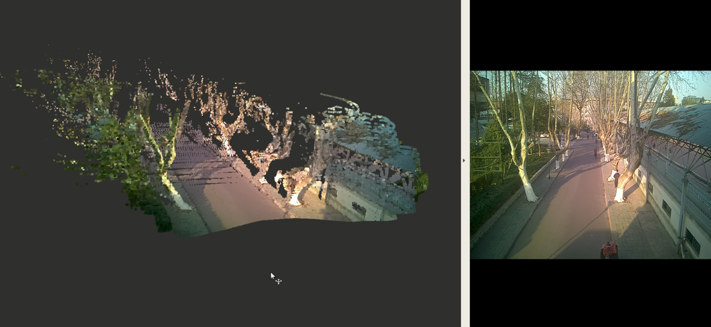

## livox_visual_fusion

#### livox激光点云与图像数据的融合，实时点云着色

### 介绍

​	实时点云着色



### 依赖

- ros-melodic
- [Eigen3](https://github.com/artsy/eigen)
- [OpenCV3.2+](https://github.com/opencv/opencv)
- [livox_SDK](https://github.com/Livox-SDK/Livox-SDK)
- [livox_driver](https://github.com/Livox-SDK/livox_ros_driver)

### Build

```
catkin_make
```

### Usage

- [相机标定](https://github.com/ethz-asl/kalibr)

- [相机雷达标定](https://gitee.com/csc105/dashboard/projects/csc105_slam_group/lidar_camera_calib/tree/calib_ui)

- config.yaml

  ```
  intrinsic_file: cam_matrix.yml
  extrinsic_file: extrinsic.yml
  distance_valid: 50
  ```

### Run

```
roslaunch livox_visual_fusion test_fusion.launch
```

